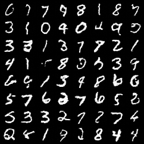
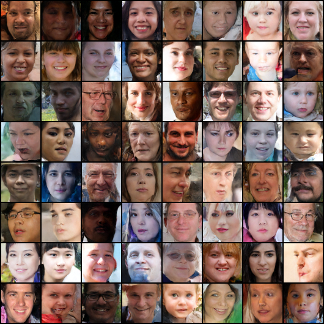
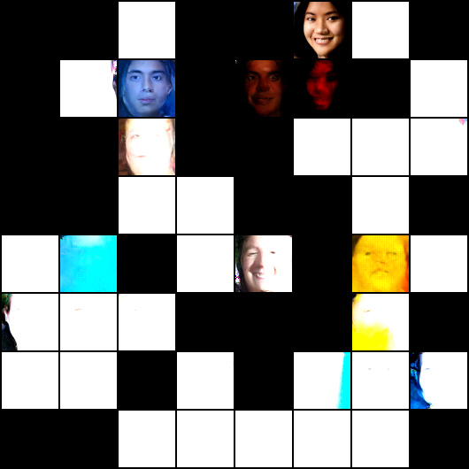
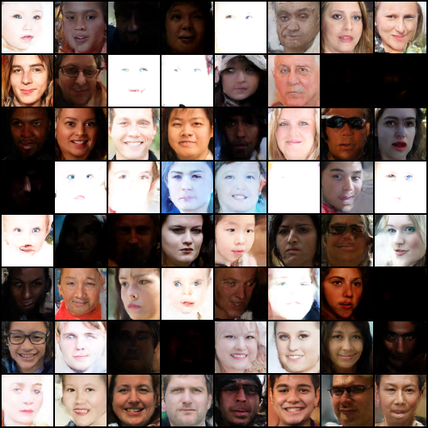
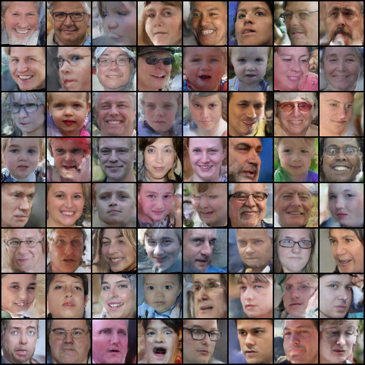

# Diffusion Models
## If you're looking for a good implementation to build upon, I suggest you to look elsewhere

This is a repo for playing around with diffusion models. 
Currently, I have an implementation that appears to work, though it still has some issues.

Example of the reverse diffusion process using a trained model, 
    showing the transition from a standard normal distribution to something very similar to the training set:

Example output on MNIST:

Output of a large (h_size=96, ~170 epochs) UResNet model trained on a cropped 64x64 FFHQ Dataset (Source: https://github.com/NVlabs/ffhq-dataset):

## Issues
The biggest problem currently is an "explosion" of the values early on in the reverse diffusion process.
The problem can be largely avoided by starting a few steps before T (i.e. T-1 or T-15). 
For instance, the FFHQ model samples from above are sampled starting at T-10.
In the most catastrophic case (starting at T) many images are completely messed up, 
    in lighter cases (i.e T-1 and beyond) there appear to be a large number of disproportionately bright or dark images.
Picking a later starting point improves quality, but reduces skin color diversity and contrast.

Sampling from T yields the following results:

Sampling from T-1 yields the following slightly better results:

Sampling from T-80 yields less variation in skin colors and lighting conditions:

