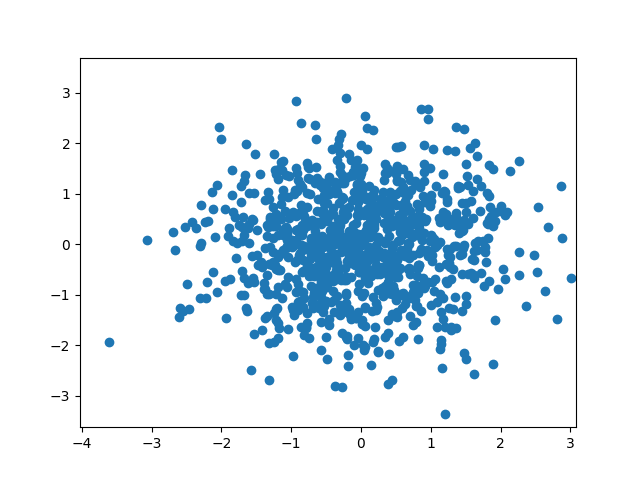

# Diffusion Models
## If you're looking for a good implementation to build upon, I suggest you to look elsewhere

This is a repo for playing around with diffusion models. 
Currently, I have an implementation for a simple 2D dataset that seems to work.

Example of the reverse diffusion process using a trained model, 
    showing the transition from a standard normal distribution to something very similar to the training set:
