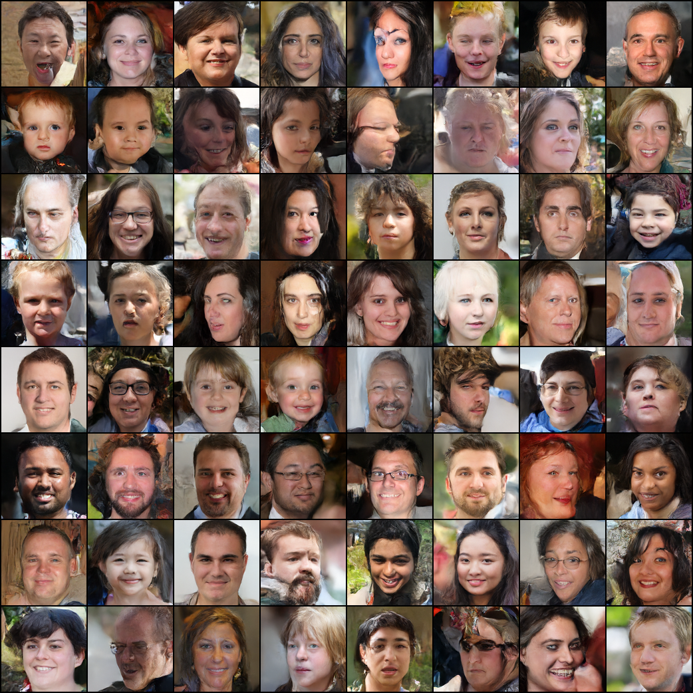
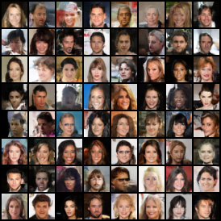

# Diffusion Models
This is a repo for playing around with diffusion models.

⚠️ Note: this is a hobby project, 
I cannot guarantee that all implementations are correct or faithful to the respective papers!

## Current results
Following the most recent commits, the models appear to behave in a stable fashion. 
Since this is a recent development as of the time of writing, I only have some results to show:

Images generated using the `eval_model.py` using DDPM (cosine schedule) with T=1000, seed=42 on a (still training) 
103 million parameter model (h_size=64, resolution 128x128 on FFHQ Thumbnails):

And some results of a cute little 32x32 model trained on CelebA for 42 epochs:

### Does DDIM work?
Not yet completely 😅:

## Citations and sources:
### Improved Denoising Diffusion Probabilistic Models (2021)
[Arxiv link](https://arxiv.org/abs/2102.09672)

This paper was the biggest source of information I used. Most notably the cosine scheduler.

### Denoising Diffusion Probabilistic Models (2020)
[Arxiv link](https://arxiv.org/abs/2006.11239)

The paper upon which the previously mentioned paper builds. 
Contains some clear math and pseudocode which made my life a lot easier.

### Denoising Diffusion Implicit Models (2020)
[Arxiv link](https://arxiv.org/abs/2010.02502)

### Datasets:
[Flickr-Faces-HQ (FFHQ)](https://github.com/NVlabs/ffhq-dataset)

[CelebA](https://mmlab.ie.cuhk.edu.hk/projects/CelebA.html)

[MNIST](http://yann.lecun.com/exdb/mnist/)

## Older results:
Example of the reverse diffusion process using a trained model on a 2D dataset, 
    showing the transition from a standard normal distribution to something very similar to the training set:

Example output on MNIST:

Output of a large (h_size=96, ~170 epochs) UResNet model trained on a cropped 64x64 FFHQ Dataset

